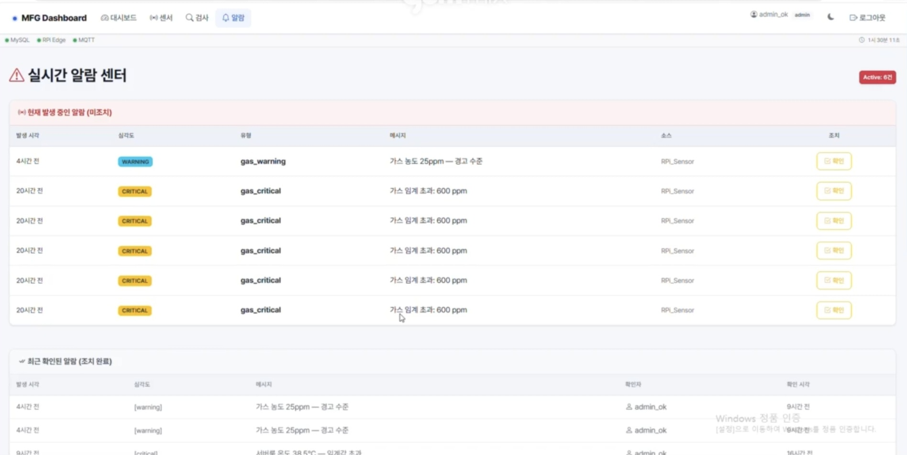
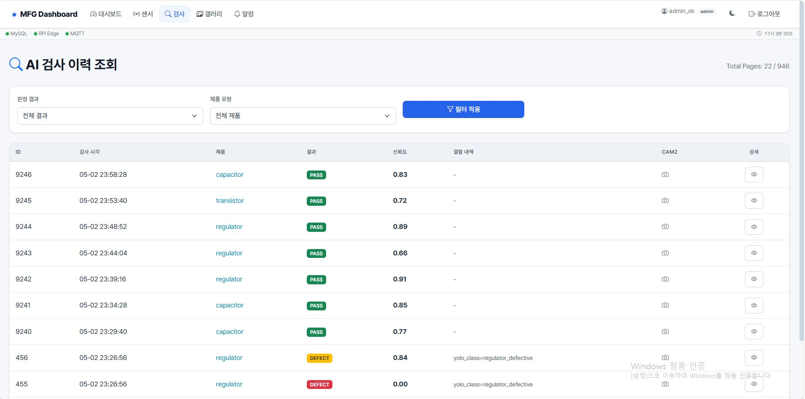
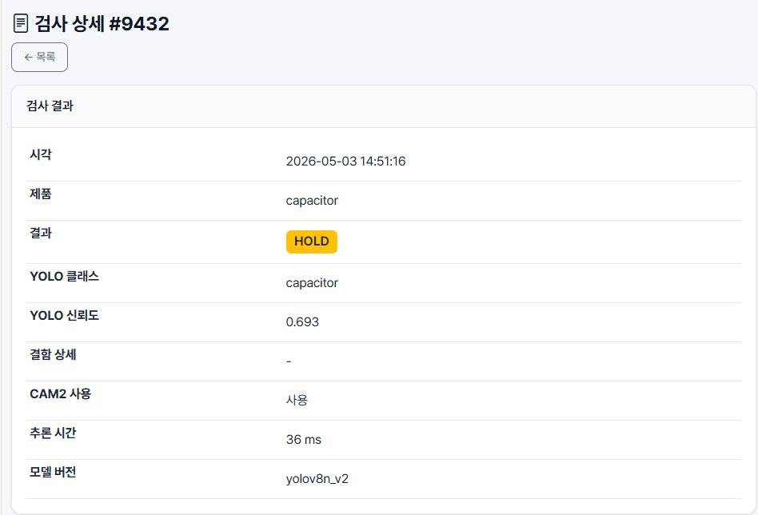
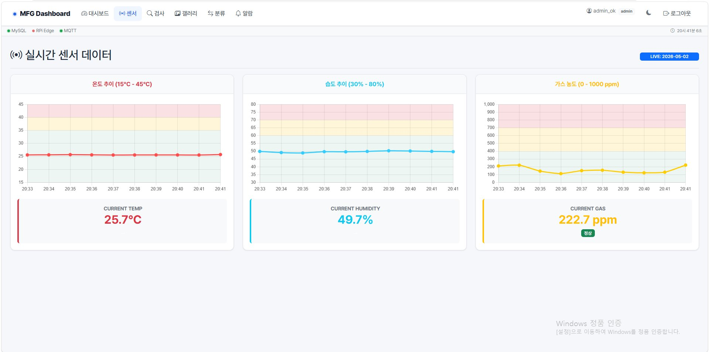
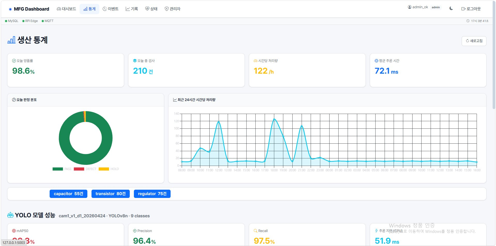
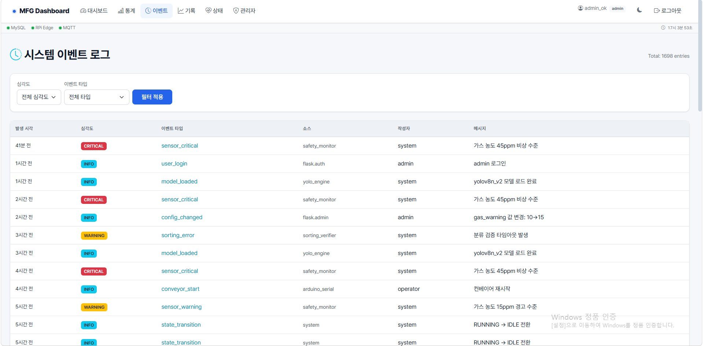
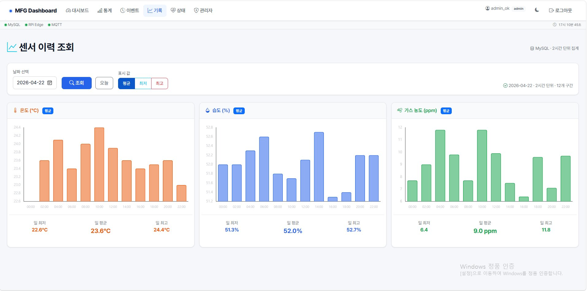

# MFG Inspection System — Flask Dashboard

Platform Engineer 담당 — Mosquitto(MQTT) + MySQL + InfluxDB + Flask + Grafana 통합 모니터링 대시보드.

제조 라인의 실시간 센서 데이터(온도·습도·가스), AI 비전 검사 결과(YOLO), 알람, 이벤트 로그를 한 화면에서 확인하고 운영자가 조치할 수 있게 만든 시스템입니다.

---

## 📷 주요 화면

| 실시간 알림 센터 | AI 검사 이력 | 검사 상세 |
|---|---|---|
|  |  |  |

| 실시간 센서 데이터 | 생산 통계 |
|---|---|
|  |  |

| 시스템 이벤트 로그 | 센서 이력 조회 |
|---|---|
|  |  |

---

## Quick Start

### 요구사항
- Python 3.10+
- MySQL 8.0
- Mosquitto 2.0
- (Hardening) Docker / Docker Compose

### 1. DB 초기화
```bash
mysql -u root -p < scripts/init_db.sql
```

### 2. Python 환경
```bash
python -m venv venv
source venv/bin/activate          # Windows: venv\Scripts\activate
pip install -r requirements.txt
```

### 3. 환경변수
`.env.example`을 복사해서 `.env`로 만들고, 본인의 실제 값으로 채워주세요.
```bash
cp .env.example .env
```
> ⚠️ `.env` 파일은 절대 깃허브에 올리지 마세요. 비밀번호·토큰이 들어가는 파일입니다. (`.gitignore`에 이미 제외 처리되어 있습니다.)

### 4. 시드 + admin 생성
```bash
python scripts/seed_data.py        # 마스터 + 테스트 데이터
python scripts/create_admin.py     # admin 비밀번호 설정 (.env 값 자동 사용)
```

### 5. 실행
```bash
python app.py
```
브라우저: http://localhost:5001/login

---

## 페이지 목록

| 경로 | 설명 | 최소 권한 |
|---|---|---|
| `/` | 실시간 대시보드 | viewer |
| `/sensors` | 환경 센서 시계열 | viewer |
| `/inspections` | 검사 이력 | viewer |
| `/sorting` | 분류 검증 이력 | viewer |
| `/events` | 시스템 이벤트 로그 | viewer |
| `/events/audit` | hash chain 감사 | maintainer |
| `/alarms` | 활성 알람 + acknowledge | viewer / operator |
| `/admin/*` | 사용자 / 제품 / 설정 관리 | admin |
| `/health` | 노드 생존 + DB 상태 | viewer |
| `/history` | 환경 이력 (분/시/6시간 집계) | viewer |
| `/failures` | 실패 사례 갤러리 | viewer |
| `/stats` | 시간당 처리량 + verdict 분포 | viewer |

## 인터페이스 동결 (팀 개발 환경 기준)

| 서비스 | 호스트:포트 |
|---|---|
| Mosquitto | 192.168.0.16:1883 / 8883 |
| MySQL | 192.168.0.16:3306 (DB `manufacturing`) |
| Flask | 192.168.0.16:5000 |
| Grafana | 192.168.0.16:3000 |
| Prometheus | 192.168.0.16:9090 |
| InfluxDB | 192.168.0.16:8086 |

> 위 IP는 팀 개발 당시 사내망(LAN) 전용 주소로, 외부에서는 접근할 수 없습니다. 다른 팀원 코드에도 같은 IP/포트가 박혀있어 변경하지 않았습니다.

## 문제 해결

| 증상 | 원인 / 조치 |
|---|---|
| `Access denied for user 'mfg_flask'` | `init_db.sql` 사용자 비밀번호와 `.env` 의 `DATABASE_URL` 불일치 |
| 로그인 후 무한 리다이렉트 | `SECRET_KEY` 비어있거나 매번 바뀜 — 고정값 지정 |
| MQTT 상태등 빨간불 | broker 미기동 또는 `MQTT_FLASK_USER` 자격증명 불일치 |
| 잠긴 admin 풀기 | `python scripts/create_admin.py --reset --username admin` |

---

## 🏗 구조

```
app.py / app_admin.py / app_field.py   # 화면별 Flask 엔트리포인트
config.py / extensions.py               # 설정, DB·로그인·소켓 초기화
models/                                   # SQLAlchemy 모델 (User, AlarmLog, SensorReading 등)
routes/                                    # 블루프린트 (dashboard, sensors, inspections, events, stats 등)
templates/                                  # Jinja2 HTML 템플릿
static/                                      # css / js / 이미지
scripts/                                      # DB 시드, admin 계정 생성, init SQL
infra/                                         # docker-compose, Prometheus/Telegraf/Grafana 설정
```
