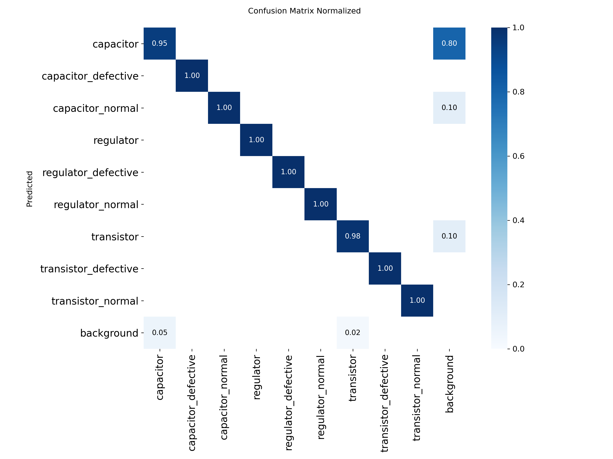

# Model Performance — cam1_v1_d1_20260424

## Training Results

| Metric | Value |
|---|---|
| mAP50 | 0.9834 |
| mAP50-95 | 0.8266 |
| Precision | 0.9636 |
| Recall | 0.9754 |
| Best Epoch | 55 / 150 |
| Total Epochs | 150 |

## Model Info

| Item | Value |
|---|---|
| Model | YOLOv8n |
| Classes | 9 (capacitor/regulator/transistor × normal/defective/body) |
| Format | ONNX (cam1_v1_d1_20260424.onnx) |
| Dataset | Roboflow mfg-cam1-top v1 |
| Training | Google Colab GPU |

## Confusion Matrix

## Inference Latency (CPU, ONNX Runtime 1.25.0)

| Metric | Value |
|---|---|
| Average | 51.9ms |
| P50 | ~52ms |
| P95 | < 100ms |
| Environment | CPU (Intel UHD 770) |
| Backend | ONNX Runtime CPUExecutionProvider |